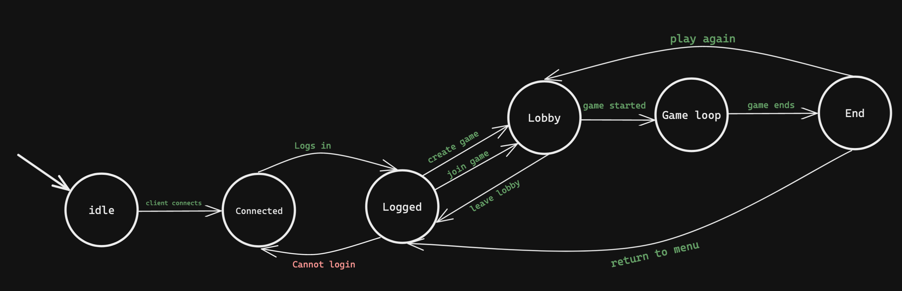

# Bonusove ulohy z KIV/UPS
## Chat server/client
slozka 01
## Navrh protokolu
### Message structure
- Kazda zprava mezi *klientem* a *serverem* ma dve casti
    - **Header** - v hlavicce zpravy je ulozeny typ zpravy a delka payloadu v bytech.
    - **Payload** - v payloadu jsou ulozena samotna data
- Program tak precte hlavicku, z ktere zjisti typ zpravy a delku payloadu na zaklade ktere pak precte samotny payload.
- V dalsim kroku pak program preda typ zpravy a payload prislusnemu handleru, ktery na zpravu adekvatne zareaguje.
### Message types
V nasledujici sekci popisu jednotlive zpravy

| Message type | Payload                              | Server Response            | verbose                                                                                                     | 
| ------------ | ------------------------------------ | -------------------------- | ----------------------------------------------------------------------------------------------------------- |
| LOGIN        | `string`: username                   | `bool`: 0(ok) / 1(error)   | prihlasovaci zprava                                                                                         |
| CREATE_LOBBY | none                                 | `string`: game id          | vytvoreni lobby. uzivatel, ktery lobby vytvoril, se stava jeho vlastnikem a je jediny, kdo muze hru zapnout |
| LOBBIES      | none                                 | `string[]`: games in lobby | pokud uzivatel nechce vytvaret vlastni lobby, muze se pripojit do jiz existujiciho lobby                    |
| JOIN_LOBBY   | `string`: game id                    | none                       | lobby, do ktere se chce uzivatel pripojit                                                                   |
| START_GAME   | none                                 | `bool`: 0(ok) / 1(error)   | zacne hru, hru muze zahajit pouze majitel hry (lobby, mistnosti)                                            |
| DIRECTION    | `int`: direction, `int`: x, `int`: y | ack                        | zmena smeru hada, na server se posle smer (UP, DOWN...) a souradnice {x,y}, kde ke zmene doslo              |
| FRUIT ATE    | none                                 | `bool`: 0(ok) / 1(error)   | zprava, kterou posle hrac potom, co snedl jablko (validace probehne na serveru)                             |
| COLLISION    | none                                 | `bool`: 0(ok) / 1(error)   | kolizni zprava, do budoucna bych chtel kolize resit ciste na serveru na zaklade DIRECTION                   |
## Game state machine

## Clients for ruby servers
slozka 04
